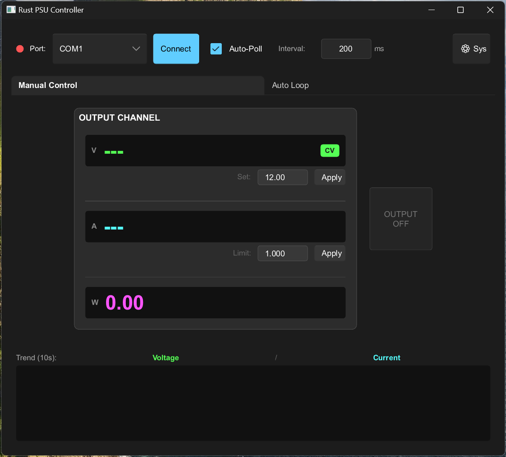

# psu-controller-rs ⚡️

[](https://github.com/yingchaotw/psu-controller-rs/actions/workflows/build.yml)



A cross-platform programmable power supply control software built with **Rust** and **Slint**.

Communicating via **SCPI (Standard Commands for Programmable Instruments)** over Serial Port (USB/RS-232), it provides a lightweight, high-performance, and modern interface for hardware engineers to control laboratory power supplies.

## ✨ Features 

### 🖥 Professional GUI 
* **Modern Dark Mode**: High-contrast dark theme designed for engineering environments.
* **Real-time Trend Chart**: Visualizes Voltage and Current stability over time with auto-scaling lines.
* **Integrated Power Meter**: Calculates and displays real-time Wattage ($P = V \times I$) alongside V/I readings.
* **Tabbed Interface**: Organized layout separating **Manual Control** and **Auto Loop** functions.

### ⚡️ Smart Control & Synchronization
* **Bi-directional Sync**: Automatically reads the device's current state (Output ON/OFF), Voltage set point, and Current limit immediately upon connection.
* **Smart Output Toggle**: Unified, large **OUTPUT** button that clearly indicates state (Blue for ON / Gray for OFF).
* **Precise CC/CV Detection**: Logic-based detection that compares real-time readings against the *active* limit (not just the input box) to accurately display **Constant Current (CC)** or **Constant Voltage (CV)** modes.

### 🎛 Intuitive Input
* **Scroll Control**: Adjust Voltage (`±0.1V`) and Current (`±0.01A`) effortlessly by hovering and scrolling the mouse wheel.
* **Safe Polling Engine**: 
  * Adjustable Auto-Poll interval (default 1s).
  * **Anti-Congestion Protection**: Automatically limits the minimum interval to **200ms** to prevent RS-232 buffer overflows and ensure smooth chart rendering.

### 🔄 Automation 
* **Waveform Loop**: Built-in square wave generator that toggles between Voltage A and Voltage B at a specified millisecond interval.

## 🛠 Tech Stack

* **Language**: [Rust](https://www.rust-lang.org/)
* **GUI Framework**: [Slint](https://slint.dev/) (Lightweight, suitable for embedded and desktop applications)
* **Serial Communication**: `serialport` crate
* **Error Handling**: `anyhow`

## 📦 Installation & Run

### Prerequisites

Ensure you have the [Rust Toolchain](https://rustup.rs/) installed.

### Build and Run

1. Clone the repository:
  ```bash
   git clone [https://github.com/yingchaotw/psu-controller-rs.git](https://github.com/yingchaotw/psu-controller-rs.git)
   cd psu-controller-rs
  ```

2. Run the application:
  ```bash
  cargo run --release
  ```

> **Note for Linux/macOS users**: If you encounter "Permission Denied", add your user to the `dialout` group or use `sudo`.

## 📖 Usage Guide

1. **Connect Hardware**: Plug in your SCPI-supported PSU via USB/Serial.
2. **Select Port**:
    * Check the status light (Red = Disconnected, Green = Connected).
    * Choose the COM Port and click **Connect**.
    * *The software will automatically sync the current settings and Output state from the device.*
3. **Manual Control (Tab 1)**:
    * **Adjust Values**: Scroll over cards or type values and click **Apply**.
    * **Monitor**: Watch the **Trend Chart** and **Power Meter (W)** for real-time load changes.
    * **Output**: Click the large **OUTPUT** button to toggle power.
4. **Adjust Refresh Rate**:
    * Enter a value in the **Interval** box (e.g., `200` ms) to change the chart speed.
    * *Note: Inputs below 200ms will be auto-corrected to protect communication stability.*
5. **Auto Loop (Tab 2)**:
    * Set **Level A**, **Level B**, and **Interval**.
    * Click **START LOOP** to begin automated voltage testing.
6. **System Settings**: Click **⚙ Sys** to access Beeper control or Factory Reset.

## 🔌 Hardware Compatibility

Supports most Programmable DC Power Supplies following the SCPI standard (IEEE 488.2), including:

* **Keysight / Agilent** (E36xx series)
* **Rigol** (DP800 series)
* **Siglent** (SPD series)
* **GW Instek**
* **Keithley**

## 📂 Project Structure

```text
psu-controller-rs/
├── Cargo.toml              # Project metadata and dependencies
├── build.rs                # Build script for compiling Slint files
├── src/
│   ├── main.rs             # Entry point: UI binding, Timer logic, Chart buffer management
│   └── scpi.rs             # SCPI driver: Command definitions (GET_SET_VOLT, OUTP?, etc.)
└── ui/
    ├── theme.slint                 # Global color palette
    ├── appwindow.slint             # Main UI layout (Tabs, Header, Chart container)
    └── components/                 
        ├── card.slint              # Basic UI Card wrapper
        ├── value_control.slint     # Voltage/Current control widget
        ├── chart.slint             # SVG path rendering for Trend Chart
        └── settings_overlay.slint  # Popup settings menu

```

## 📝 License

This project is licensed under the MIT License - see the [LICENSE](https://www.google.com/search?q=LICENSE) file for details.