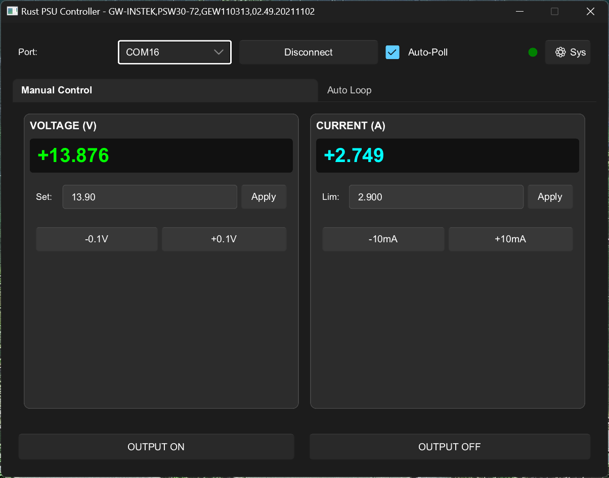
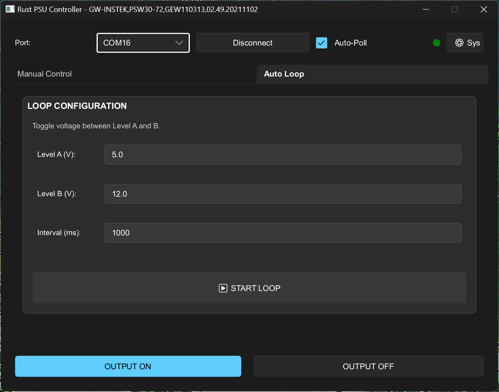

# psu-controller-rs ⚡️

[](https://github.com/yingchaotw/psu-controller-rs/actions/workflows/build.yml)




A cross-platform power supply control software built with **Rust** and **Slint**.

Communicating via **SCPI (Standard Commands for Programmable Instruments)** over Serial Port (USB/RS-232), it provides a lightweight, high-performance, and modern interface for hardware engineers to control programmable power supplies.

## ✨ Features 

### 🖥 Professional GUI 

* **Modern Dark Mode**: High-contrast dark theme designed for engineering environments to reduce eye strain.
* **Tabbed Interface**: Organized layout separating **Manual Control** and **Auto Loop** functions.
* **Dynamic Window Title**: Automatically displays the connected device's model and version info (IDN).

### ⚡️ Precision Control 

* **Intuitive Scroll Control**:
  * Adjust Voltage/Current effortlessly by hovering and scrolling the mouse wheel.
  * Voltage: `±0.1V` steps via scroll.
  * Current: `±0.01A` steps via scroll.

* **Status Indicators**:
  * Visual **CC (Constant Current)** and **CV (Constant Voltage)** mode feedback directly on the control panel.

* **Real-time Monitoring**:
* **Auto-Poll**: Checkbox to toggle 1s interval automatic background polling (`MEAS:ALL?`).
* **Manual Refresh**: One-click instantaneous readback.

### 🔄 Automation 

* **Waveform Loop**: Built-in square wave generator that toggles between Voltage A and Voltage B at a specified millisecond interval.

### 🛡 Safety & System 

* **Smart Output Status**: Output buttons change color (Blue/Gray) to reflect the actual power state.
* **Auto-Unlock**: Automatically sends `SYST:LOC` to unlock the device panel upon disconnection.
* **System Settings**: Dedicated menu for **Beeper Control** and **Factory Reset (*RST)** to prevent accidental operations.

## 🛠 Tech Stack

* **Language**: [Rust](https://www.rust-lang.org/)
* **GUI Framework**: [Slint](https://slint.dev/) (Lightweight, suitable for embedded and desktop applications)
* **Serial Communication**: `serialport` crate
* **Error Handling**: `anyhow`

## 📦 Installation & Run

### Prerequisites

Ensure you have the [Rust Toolchain](https://rustup.rs/) installed.

### Build and Run

1. Clone the repository:
```bash
git clone https://github.com/yingchaotw/psu-controller-rs.git
cd psu-controller-rs

```


2. Run the application:
```bash
cargo run --release

```


> **Note for Linux/macOS users**: If you encounter "Permission Denied", add your user to the `dialout` group or use `sudo`.


## 📖 Usage Guide

1. **Connect Hardware**: Connect your SCPI-supported PSU via USB.
2. **Select Port**: Choose the COM Port from the top dropdown.
3. **Connect**: Click **Connect**. The window title will update with the device model.
4. **Manual Control (Tab 1)**:
   * **Hover and Scroll** over the Voltage or Current cards to adjust values.
   * Click **Apply** to set specific values via the input box.
   * Observe the **CC/CV** indicators to monitor the power supply mode.


5. **Auto Loop (Tab 2)**:
* Set **Level A**, **Level B**, and **Interval (ms)**.
* Click **START LOOP** to begin automated voltage toggling.


6. **Output Control**: Use the global **OUTPUT ON/OFF** buttons at the bottom. The ON button turns **Blue** when active.
7. **System Settings**: Click the **⚙ Sys** button in the top-right to access Beeper control or Factory Reset.

## 🔌 Hardware Compatibility

Supports most Programmable DC Power Supplies following the SCPI standard (IEEE 488.2), including:

* **Keysight / Agilent** (E36xx series)
* **Rigol** (DP800 series)
* **Siglent** (SPD series)
* **GW Instek**
* **Keithley**

## 📂 Project Structure

```text
psu-controller-rs/
├── Cargo.toml              # Project metadata and dependencies (slint, serialport, etc.)
├── build.rs                # Build script for compiling Slint files into Rust code
├── src/
│   ├── main.rs             # Application entry point: UI event binding and timer logic
│   └── scpi.rs             # SCPI driver: Command definitions and serial I/O functions
└── ui/
    ├── theme.slint                 # 1. 全域配色設定
    ├── components/                 # 2. 自訂元件資料夾
    │   ├── card.slint              #    基礎卡片元件
    │   ├── value_control.slint     #    數值控制 (電壓/電流) 元件
    │   └── settings_overlay.slint  #    設定選單元件
    └── appwindow.slint             # 3. 主視窗 (組裝所有東西)
```

## 📝 License

This project is licensed under the MIT License - see the [LICENSE](https://www.google.com/search?q=LICENSE) file for details.