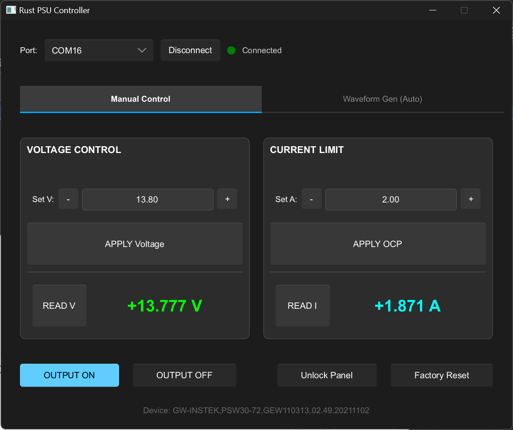

# psu-controller-rs ⚡️

[](https://www.rust-lang.org/)
[](https://slint.dev/)



A cross-platform power supply control software built with **Rust** and **Slint**.

Communicating via **SCPI (Standard Commands for Programmable Instruments)** over Serial Port (USB/RS-232), it provides a lightweight, high-performance, and modern interface for hardware engineers to control programmable power supplies.

## ✨ Features

  * **🚀 Blazing Fast & Lightweight**: Written in Rust and natively compiled. No heavy runtimes (like Python or JVM) required.
  * **🎨 Modern Dark Mode**: Designed for engineers working long hours. Features a high-contrast dark theme for clear readability without eye strain.
  * **🔌 Auto Port Detection**: Automatically scans and lists available COM Port / TTY devices upon startup.
  * **🎛 Comprehensive Control**:
      * **Voltage/Current Set**: Supports `VOLT` and `CURR` commands.
      * **Real-time Readout**: One-click readback of actual current values (`MEAS:CURR?`).
      * **Safety Mechanisms**: Supports Output toggling (`OUTP ON/OFF`) and Panel Unlock (`SYST:LOC`).
  * **🖥 Responsive Layout**: Slint-based dashboard design that automatically adapts to window resizing.

## 🛠 Tech Stack

  * **Language**: [Rust](https://www.rust-lang.org/)
  * **GUI Framework**: [Slint](https://slint.dev/) (Lightweight, suitable for embedded and desktop applications)
  * **Serial Communication**: `serialport` crate
  * **Error Handling**: `anyhow`

## 📦 Installation & Run

### Prerequisites

Ensure you have the [Rust Toolchain](https://rustup.rs/) installed.

### Build and Run

1.  Clone the repository:

    ```bash
    git clone https://github.com/yingchaotw/psu-controller-rs.git
    cd psu-controller-rs
    ```

2.  Run the application:

    ```bash
    cargo run --release
    ```

> **Note**: Linux/macOS users encountering "Permission Denied" errors should ensure the current user has access to USB devices (e.g., add the user to the `dialout` group or temporarily use `sudo`).

## 📖 Usage Guide

1.  **Connect Hardware**: Connect your SCPI-supported power supply via USB.
2.  **Select Port**: Choose the corresponding COM Port from the dropdown menu in the top-left corner.
3.  **Connect**: Click **Connect**. The status indicator will turn green upon a successful connection.
4.  **Set Parameters**:
      * Enter target voltage in **Voltage Control** (e.g., `12.0`) and click **SET Voltage**.
      * Enter current limit in **Current Monitor** (e.g., `1.5`) and click **SET OCP**.
5.  **Enable Output**: Click the large **OUTPUT ON** button at the bottom to enable power output.
6.  **Read Values**: Click the **READ** button; the actual current return value will be displayed on the right.
7.  **Disconnect**: Click **Disconnect**. The software will automatically send `SYST:LOC` to unlock the device panel before disconnecting.

## 🔌 Hardware Compatibility

This software supports most Programmable DC Power Supplies that follow the SCPI standard (IEEE 488.2), including but not limited to:

  * **Keysight / Agilent** (E36xx series, etc.)
  * **Rigol** (DP800 series, etc.)
  * **Siglent** (SPD series)
  * **GW Instek**
  * **Keithley**

*Please ensure your device supports SCPI commands via Serial Port (Virtual COM).*

## 📂 Project Structure

```text
psu-controller-rs/
├── Cargo.toml              # Dependency configuration
├── build.rs                # Slint build script
├── src/
│   └── main.rs             # Main logic (Serial communication)
└── ui/
    └── appwindow.slint     # UI layout and styling definitions
```

## 📝 License

This project is licensed under the MIT License - see the [LICENSE](LICENSE) file for details.